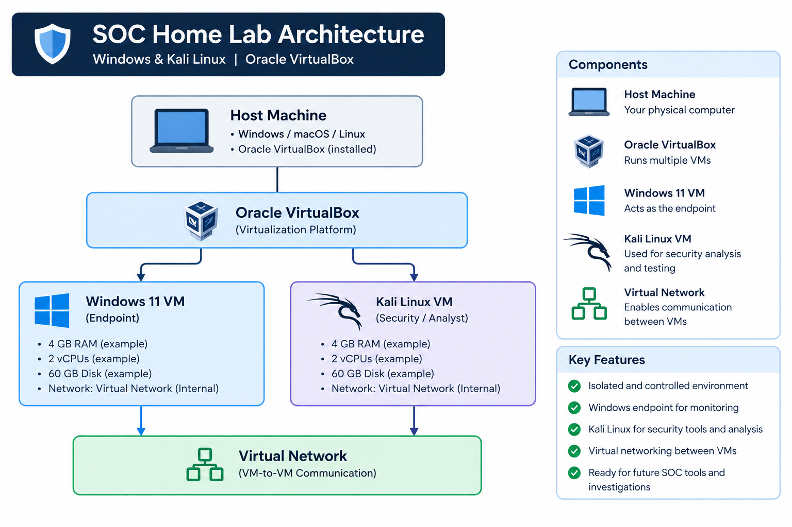
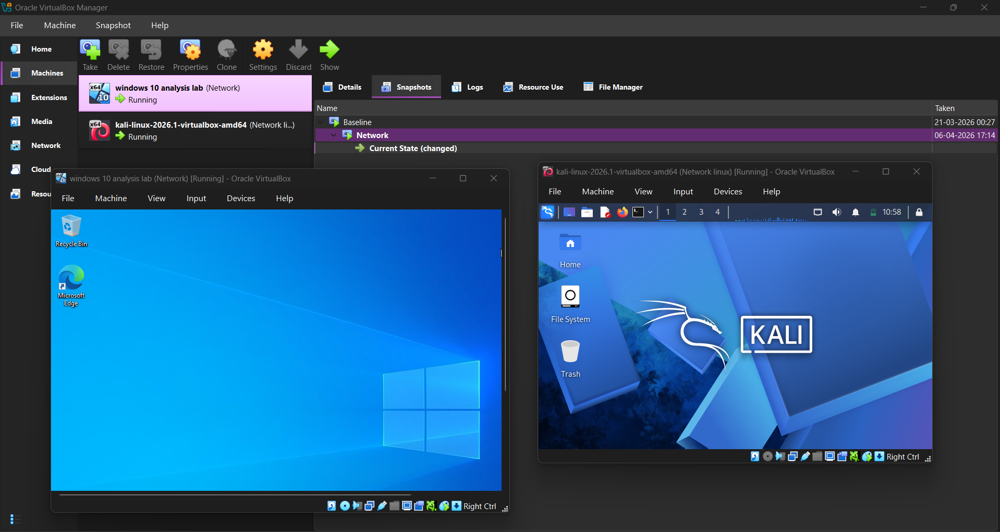
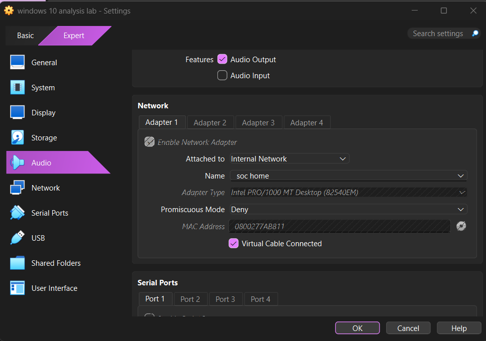
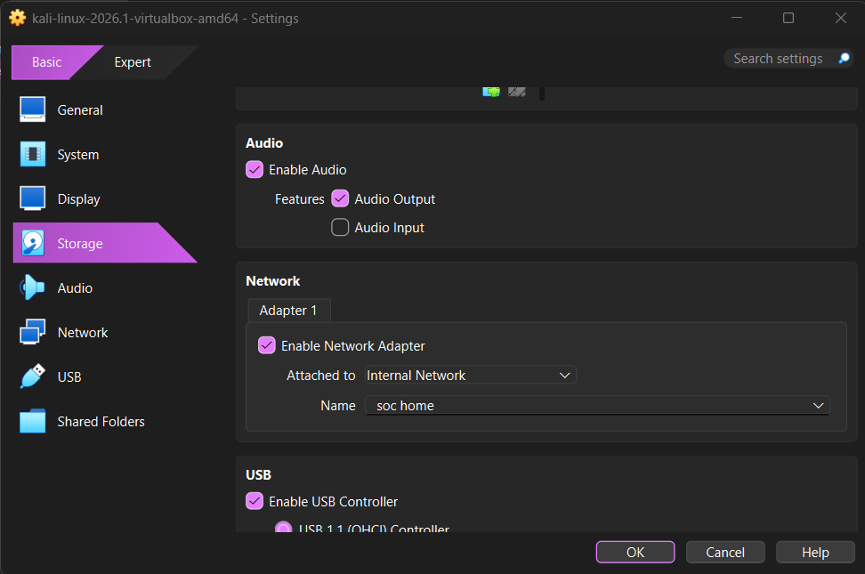
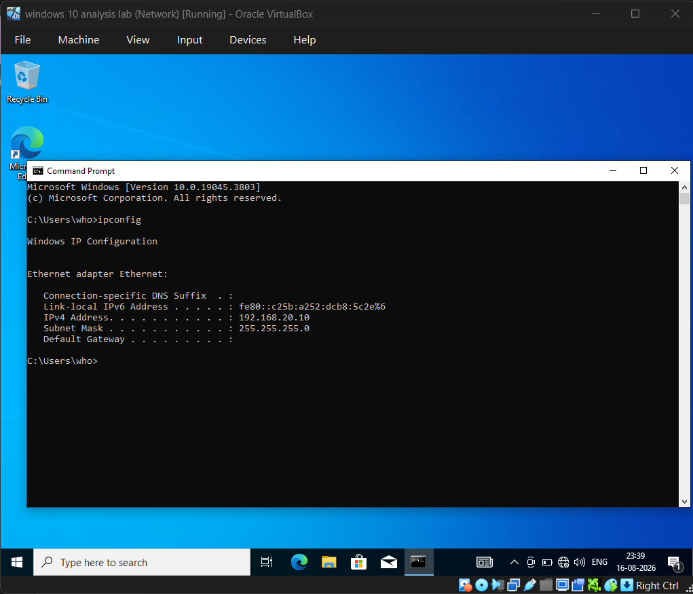
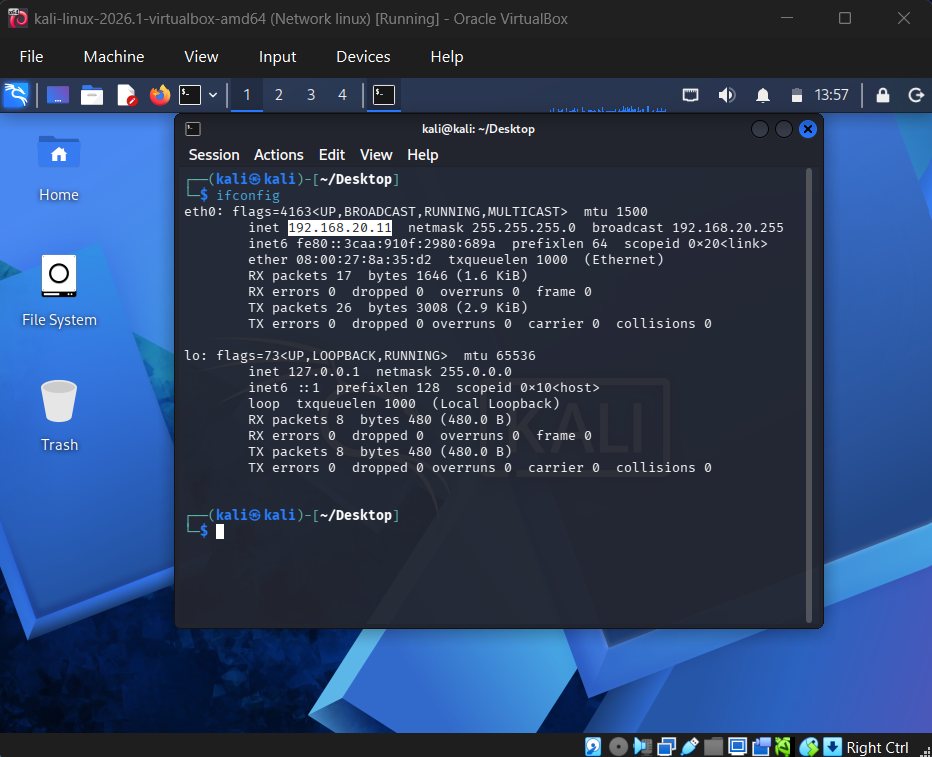
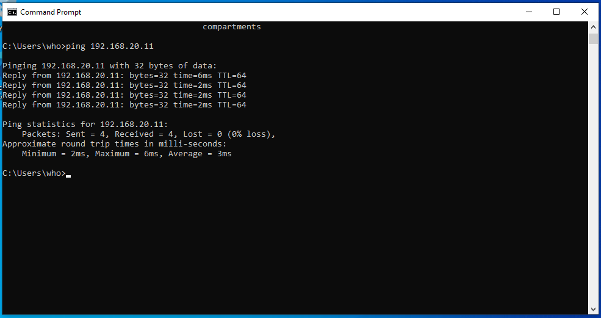
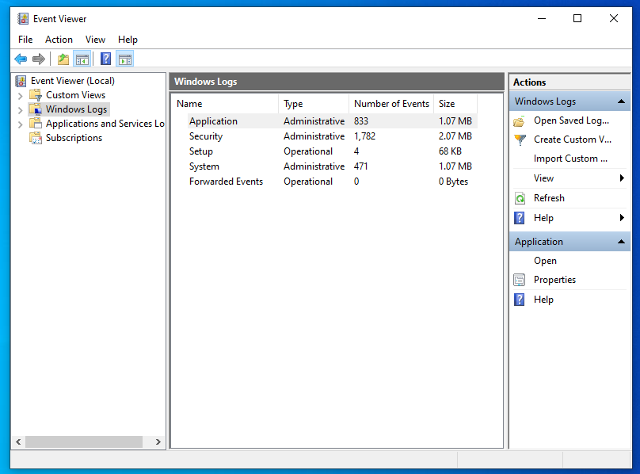

# 🛡️ SOC Home Lab — Windows & Kali Linux

A personal cybersecurity home lab built using **Oracle VirtualBox**, consisting of a Windows endpoint and Kali Linux security workstation.

The purpose of this project is to build a controlled environment for learning and practicing cybersecurity concepts such as network monitoring, security logging, threat detection, and incident response.

> **Note:** This repository documents only the **setup and configuration of the SOC home lab**. Simulated attack scenarios and security investigations will be documented separately in future projects.

---

## 📌 Project Overview

A Security Operations Center (SOC) requires an environment where security events can be generated, collected, monitored, and analyzed.

To create a foundation for hands-on SOC learning, I built a virtualized lab environment using Oracle VirtualBox.

The current lab consists of:

- 🪟 Windows virtual machine — Endpoint
- 🐉 Kali Linux virtual machine — Security/Analyst workstation
- 📦 Oracle VirtualBox — Virtualization platform
- 🌐 Virtual network — Communication between the virtual machines

The goal of this project is to create a controlled environment that can later be expanded with security monitoring and detection tools.

---

## 🏗️ Lab Architecture



**Figure 1 — Architecture of the SOC home lab.**

```text
                         HOST MACHINE
                              │
                       Oracle VirtualBox
                              │
                ┌─────────────┴─────────────┐
                │                           │
                ▼                           ▼
        ┌───────────────┐           ┌───────────────┐
        │   Windows VM  │           │  Kali Linux   │
        │               │           │      VM       │
        │   Endpoint    │◄─────────►│   Analyst /   │
        │               │  Virtual  │ Security Lab  │
        └───────────────┘  Network  └───────────────┘
```

---

# 🎯 Objectives

The main objectives of this project were:

- Build a virtualized cybersecurity laboratory.
- Configure Windows as a monitored endpoint.
- Configure Kali Linux as a security testing/analysis machine.
- Configure networking between the virtual machines.
- Verify communication between the systems.
- Explore Windows security logging.
- Create a foundation for future SOC detection and investigation exercises.

---

# 🖥️ Lab Environment

| Component | Purpose |
|---|---|
| Oracle VirtualBox | Virtualization platform |
| Windows VM | Endpoint / future monitored system |
| Kali Linux VM | Security testing and analysis |
| Virtual Network | Communication between VMs |

---

# ⚙️ 1. Installing Oracle VirtualBox

The first step was setting up **Oracle VirtualBox**, which provides the virtualization environment required to run multiple operating systems on the host machine.

After installing VirtualBox, I created separate virtual machines for Windows and Kali Linux.

### VirtualBox Environment



**Figure 2 — Windows and Kali Linux virtual machines configured in Oracle VirtualBox.**

---

# 🪟 2. Creating the Windows Virtual Machine

The Windows virtual machine acts as the endpoint in the lab.

The VM was configured with appropriate CPU, RAM, storage, and networking resources according to the available hardware of the host machine.

### Windows VM Configuration



**Figure 3 — Windows virtual machine configuration in Oracle VirtualBox.**

The main configuration areas included:

- CPU allocation
- Memory allocation
- Virtual disk
- Network adapter
- Boot configuration

---

# 🐉 3. Creating the Kali Linux Virtual Machine

Kali Linux was configured as the security testing and analysis machine.

Kali provides a wide range of tools that can later be used for network analysis, security testing, reconnaissance, and other cybersecurity exercises within the isolated lab.

### Kali Linux VM Configuration



**Figure 4 — Kali Linux virtual machine configuration.**

The VM configuration included:

- CPU allocation
- RAM allocation
- Virtual disk
- Network adapter
- Boot configuration

---

# 🌐 4. Configuring the Virtual Network

After creating both virtual machines, the next step was configuring their network connectivity.

The objective was to allow the Windows and Kali Linux machines to communicate within the controlled lab environment.

The network configuration was performed through the VirtualBox network settings.

### Network Configuration


**Figure 5 — Network configuration used for the virtual machines.**

The virtual network provides the communication layer between the Windows endpoint and Kali Linux machine.

---

# 🔍 5. Finding the Windows IP Address

After starting the Windows virtual machine, I checked its network configuration using:

```cmd
ipconfig
```

### Windows Network Configuration



**Figure 6 — Windows IP configuration showing the assigned network address.**

The IP address is required for testing communication between the two virtual machines.

> **Security note:** Sensitive information such as public IP addresses, usernames, or other personal information should be removed or blurred before publishing screenshots.

---

# 🔍 6. Finding the Kali Linux IP Address

On Kali Linux, I used:

```bash
ip addr
```

or:

```bash
ip a
```

### Kali Network Configuration



**Figure 7 — Kali Linux network interface and IP configuration.**

The assigned IP address was used to verify connectivity with the Windows machine.

---

# 🔗 7. Testing Connectivity

After obtaining the IP addresses of both systems, I tested communication between the virtual machines.

From Kali Linux:

```bash
ping <WINDOWS-IP>
```

### Connectivity Test



**Figure 8 — Connectivity test between Kali Linux and the Windows virtual machine.**

Successful responses confirmed that the two virtual machines could communicate through the configured virtual network.

This confirmed that the basic networking layer of the SOC lab was functioning correctly.

---

# 🪟 8. Exploring Windows Security Logs

Windows provides several sources of security-related telemetry that can later be useful for SOC monitoring and investigation.

I explored the Windows Event Viewer, particularly:

```text
Event Viewer
└── Windows Logs
    └── Security
```

### Windows Event Viewer



**Figure 9 — Windows Security Event Log.**

Windows Security logs can contain information related to:

- Authentication
- Account activity
- Security events
- Logon events
- System activity

Understanding these logs provides an important foundation for future security monitoring exercises.

---

# 🧪 9. Initial Lab Verification

At this stage, the basic SOC laboratory was successfully established.

The environment consists of:

```text
Windows Endpoint
       │
       │
       ▼
Virtual Network
       │
       │
       ▼
Kali Linux
```

The following components were verified:

- [x] Oracle VirtualBox installed
- [x] Windows VM created
- [x] Kali Linux VM created
- [x] Virtual networking configured
- [x] Windows IP identified
- [x] Kali IP identified
- [x] Network connectivity verified
- [x] Windows Security Event Logs explored

---

# 📚 What I Learned

Building this lab helped me understand several practical concepts that are difficult to learn through theory alone.

### Virtualization

I gained hands-on experience creating and configuring multiple operating systems inside a virtualized environment.

### Virtual Networking

I learned how virtual machines communicate and how network configuration affects communication between systems.

### Windows Security Logging

I became familiar with Windows Event Viewer and the type of security telemetry available on a Windows endpoint.

### Building a Security Lab

Most importantly, I now have a controlled environment where I can safely perform future cybersecurity exercises.

---

# 🚀 Future Plans

This lab is intended to be continuously expanded.

Future additions may include:

- [ ] Sysmon
- [ ] SIEM platform
- [ ] Centralized log collection
- [ ] Log forwarding
- [ ] Detection rules
- [ ] Network monitoring
- [ ] Threat intelligence
- [ ] Security alerts
- [ ] Simulated attack scenarios
- [ ] Incident investigation
- [ ] Incident response exercises
- [ ] Detection engineering

The attack simulations and investigations will be documented separately rather than being included in this initial lab setup project.

---

# 📂 Repository Structure

```text
SOC-Home-Lab/
│
├── README.md
│
└── screenshots/
    │
    ├── lab-architecture.png
    ├── virtualbox-overview.png
    ├── windows-vm-settings.png
    ├── kali-vm-settings.png
    ├── network-settings.png
    ├── windows-ipconfig.png
    ├── kali-ip.png
    ├── network-connectivity.png
    └── windows-event-viewer.png
```

---

# ⚠️ Disclaimer

This project is created strictly for educational and cybersecurity learning purposes.

Any future security testing or attack simulation associated with this laboratory will be performed only against systems that I own or have explicit authorization to test.

---

# 🔗 Detailed Documentation

I have documented the complete process of building this SOC home lab on Hashnode.

**Hashnode Article:**  
[Hashnode article link](https://understanding-soc-as-a-learner.hashnode.dev/building-my-first-soc-home-lab-with-windows-kali-linux-using-oracle-virtualbox?utm_source=hashnode&utm_medium=feed)

---

# 👨‍💻 Author

**Ridesh Bijwe**

Computer Engineering Student | Cybersecurity Enthusiast | SOC Analyst Learner

---

⭐ If you found this project useful, feel free to explore the repository and follow my cybersecurity learning journey.
